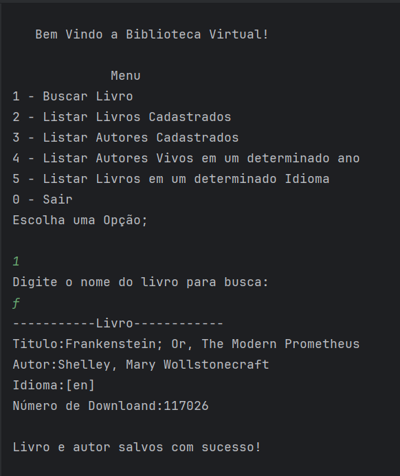
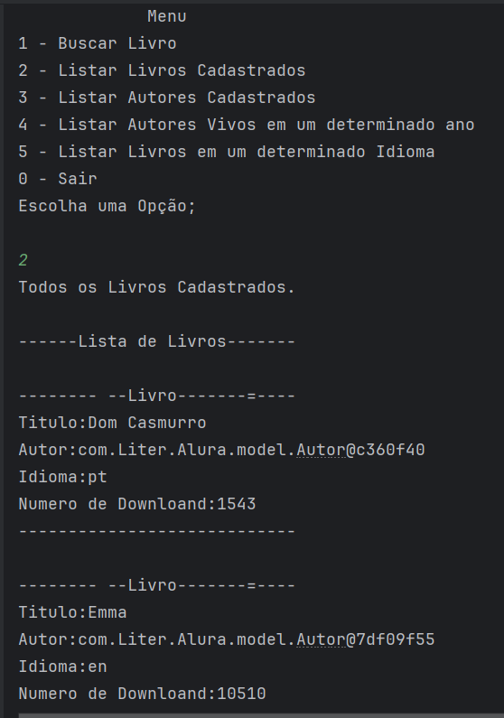
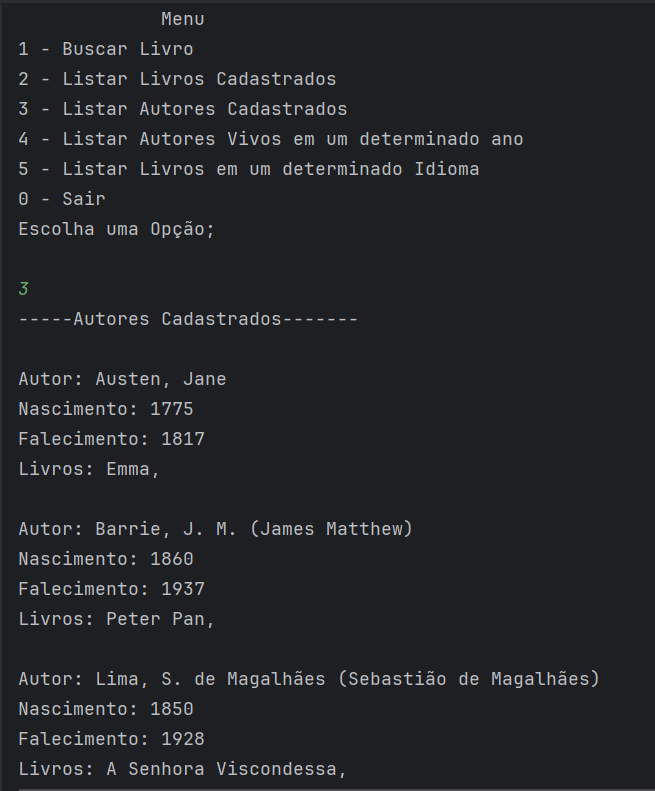
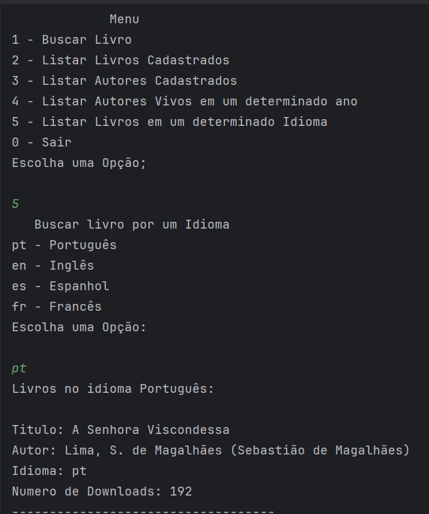

# Projeto Educacional LiterAlura 📚

## Introdução 🖋️
Sistema com consumo de uma  API para buscar na WEb titulos de Livros em varios idiomas.

## Objetivo 🎯
O sistema foi desenvolvido para fazer uma buscar de titulos de livros em uma API que contém mais de 70.000 livros. Cada busca traz informações relevantes sobre cada Livro, por exemplo: Titulo, autor, Nascimento, falecimento e total de downloand. 

## Funções⚙️
 - Buscar Livro 
 - Listar Livros Cadastrados
 - Listar Autores Cadastrados
 - Listar Autores Vivos em um determinado ano
 - Listar Livros em um determinado Idioma
## Prints de Tela 📸

- Buscar Livro.

- Listar Livros Cadastrados

- Listar Autores Cadastrados

- Listar Autores vivos por Ano.

- Listar livros por Idioma.

## Tecnologias Utilizadas 💻

## Desenvolvimento 🛠️

 - Rodrigo Soares

## Rede Social

